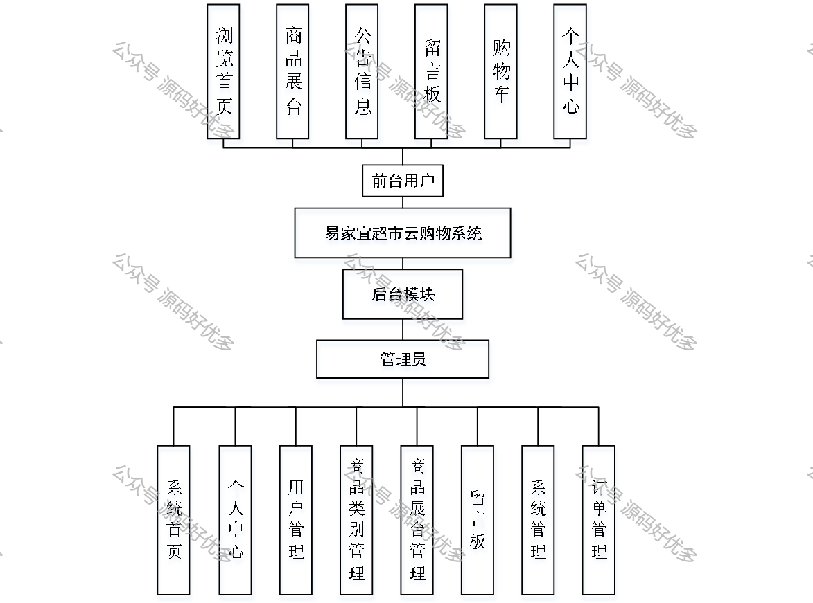
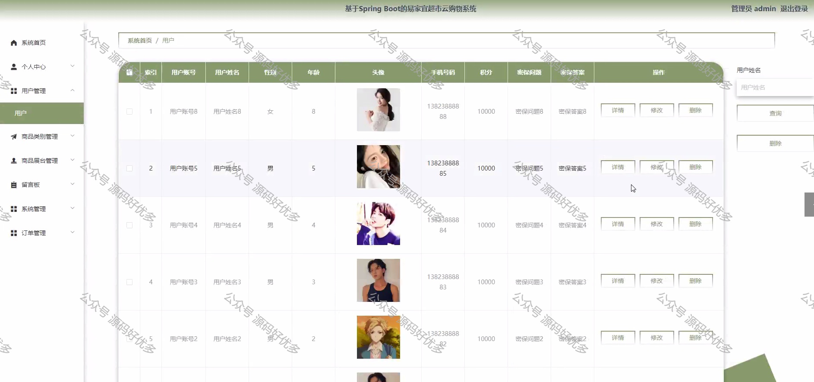

 
## 查看主页获取源码

### 一、作品包含

源码+数据库+设计文档万字+PPT+全套环境和工具资源+部署教程

### 二、项目技术

前端技术：Html、Css、Js、Vue、Element-ui

数据库：MySQL

后端技术：Java、Spring Boot、MyBatis

  

### 三、运行环境

开发工具：IDEA/eclipse

数据库：MySQL5.7

数据库管理工具：Navicat10以上版本

环境配置软件： JDK1.8+Maven3.6.3

前端Nodejs：14

### 四、项目介绍
项目编号：springbootA334

本系统在一般易家宜超市云购物系统的基础上增加了首页推送最新信息的功能，方便用户快速浏览，是一个高效的、动态的、交互友好的易家宜超市云购物系统。

本系统系统包括前台用户、后台模块管理员两个主要角色。  
1. 前台用户：浏览首页、商品展台、公告信息、留言板、购物车和个人中心；  
2. 后台模块管理员：系统管理（系统首页、个人中心）、用户管理、商品类别管理、商品展台管理、留言板管理和订单管理。

### 五、运行截图

  
